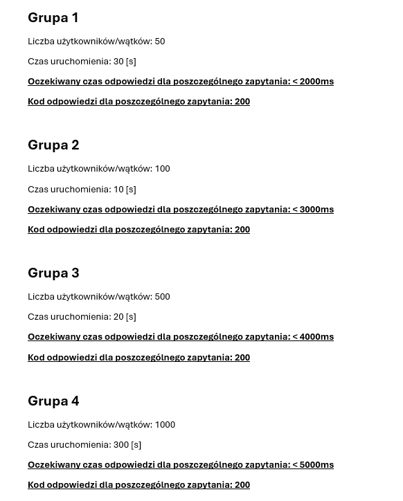
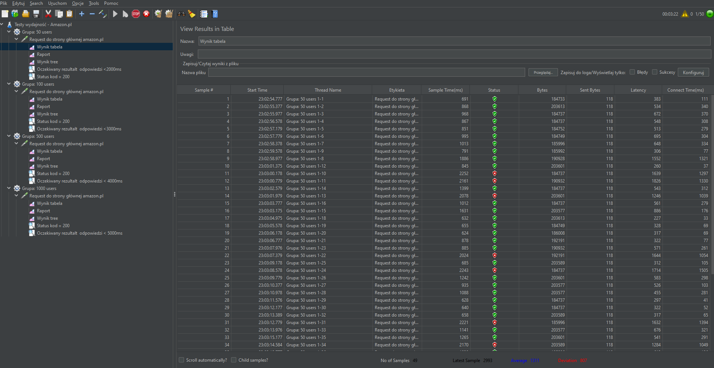
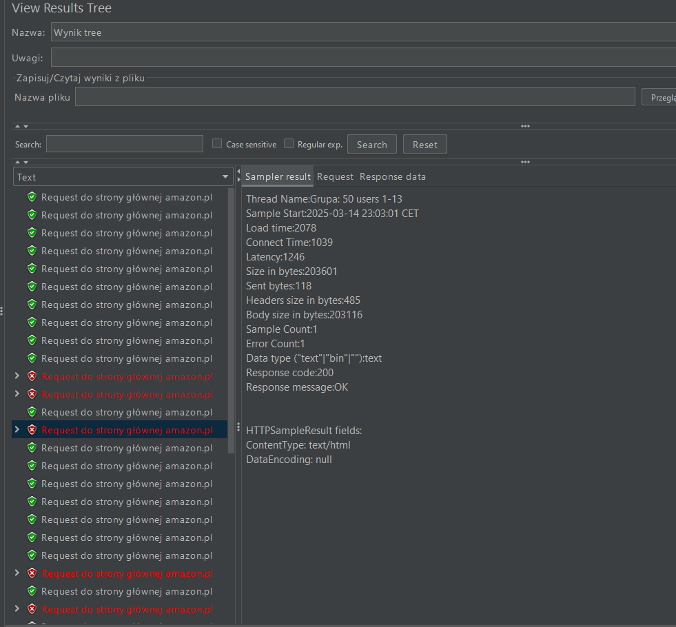
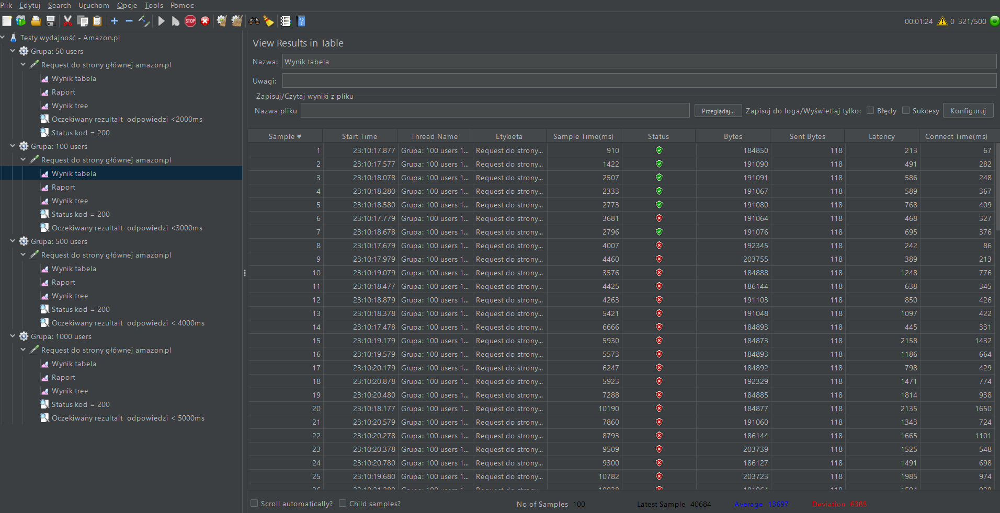
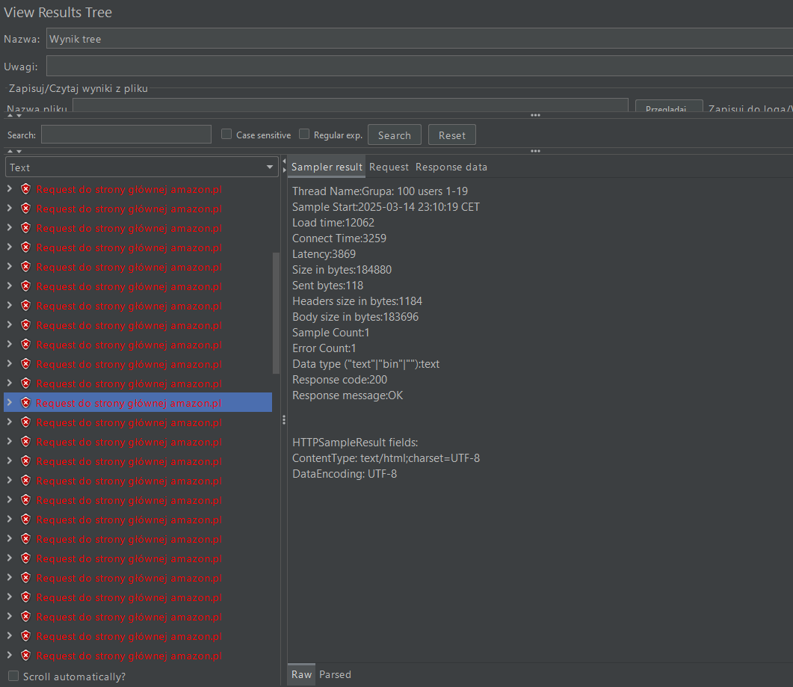
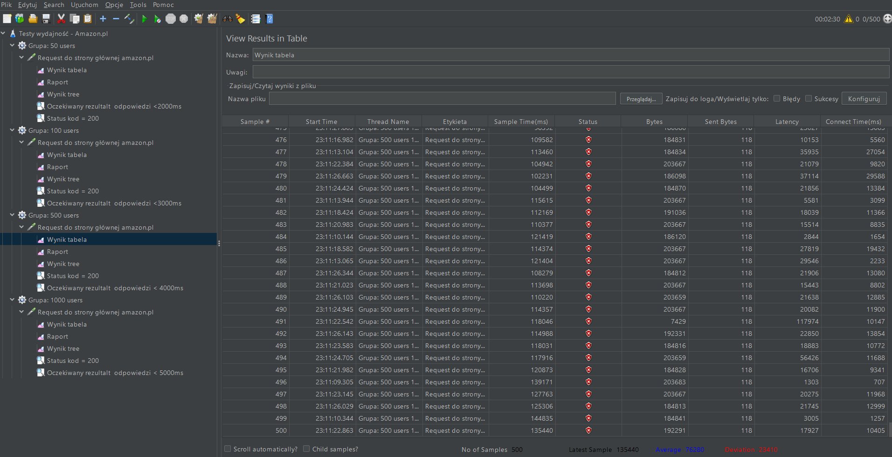
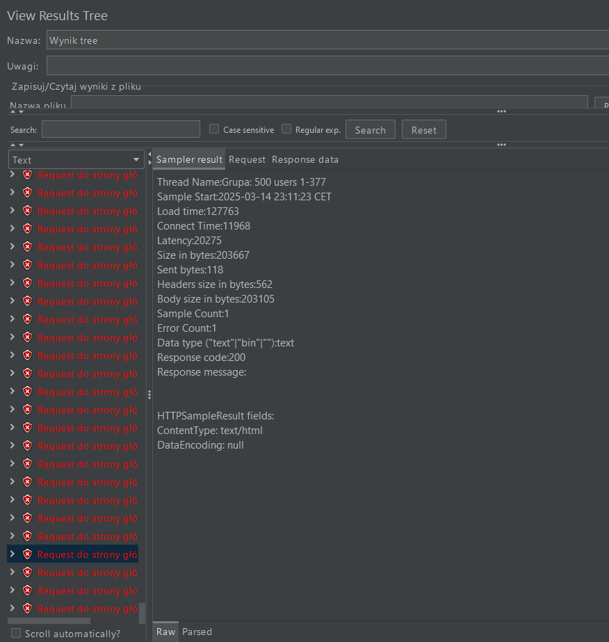
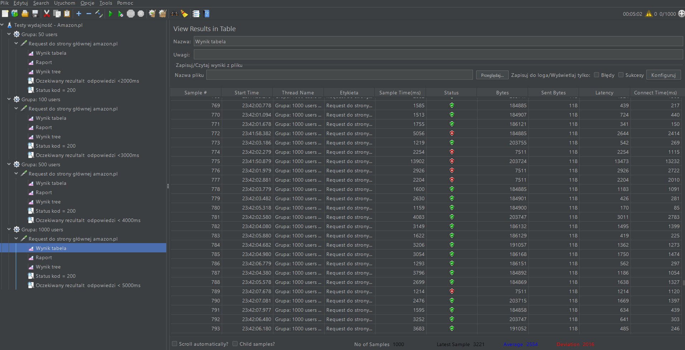
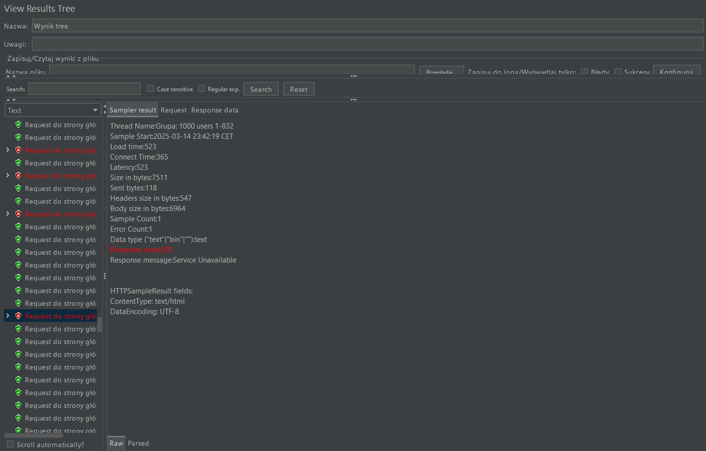

<h1>Scenariusz testowy</h1>

<h2>Wyniki dla 50 users</h2>

WYNIK: FAIL

<h2>Wyniki dla 100 users</h2>

WYNIK: FAIL

<h2>Wyniki dla 500 users</h2>

WYNIK: FAIL

<h2>Wyniki dla 1000 users</h2>

WYNIK: FAIL

